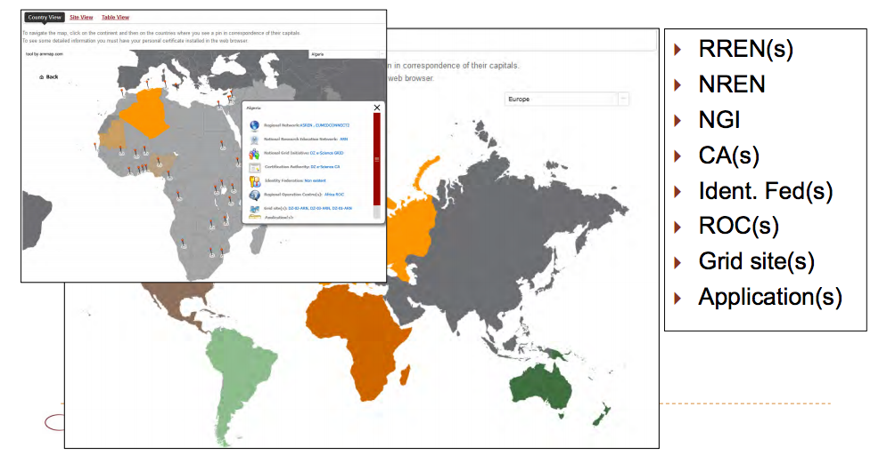
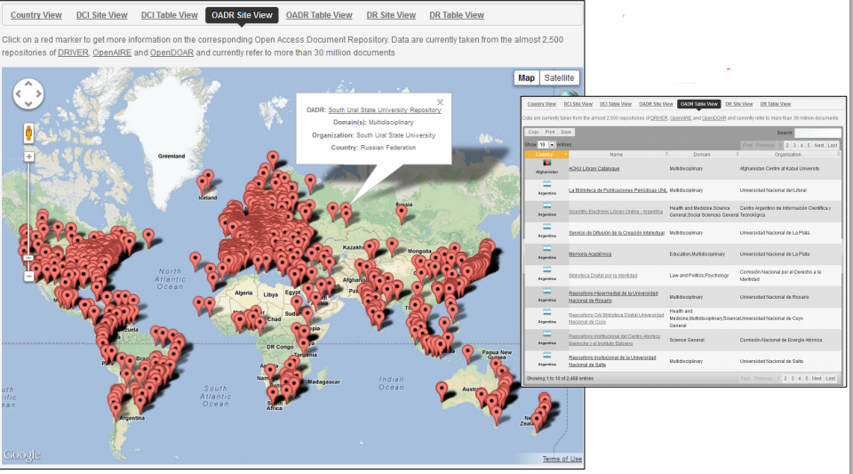
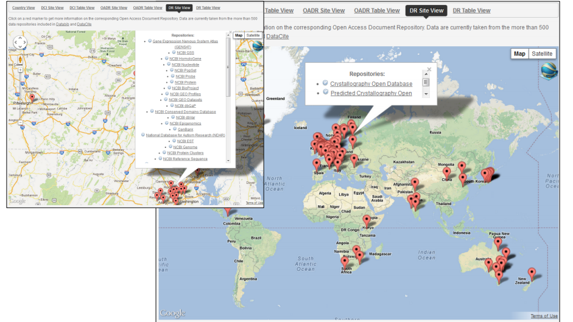

*********************
knowledge Base  Docs
*********************

============
About
============

The `CHAIN-REDS Knowledge Base <http://www.chain-project.eu/knowledge-base>`_ is one of the largest existing e-Infrastructure-related
digital information systems. It currently contains information, gathered both from dedicated surveys and other web and documental sources, for largely more than half of the countries in the world.
Information is presented to visitors through geographic maps and tables.
Users can choose a continent in the map and, for each country where a marker is
displayed, get the information about the Regional Research & Education Network(s) and the Grid Regional Operation Centre(s) (ROCs) the country belongs to as well as the National Research & Education Network, the National Grid Initiative, the Certification Authority, and the
Identity Federation available in the country, down to the Grid site(s) running in the country and the scientific application(s) developed by researchers of the country and running on those sites. 

Besides e-Infrastructure sites, services and applications, the CHAIN-REDS Knowledge Base publishes information about Open Access Document Repositories and Data Repositories. 

- Open Access Document Repositories - 

- Data Repositories - 

Although it is quite useful to have a central access point to thousands of repositories and millions of documents and datasets, with both geographic and tabular information, the OADR and DR part of the CHAIN-REDS Knowledge Base is only a demonstrator with limited impact on scientists’ day-by-day life. In order to find a document or a dataset, users should know beforehand what they are looking for and there is no way to correlate documents and data which would actually be of the most important facilitators of the Scientific Method.
In order to overcome these limitations and turn the Knowledge Base into a powerful research tool, the `CHAIN-REDS <http://www.chain-project.eu/>`_ consortium has decided to semantically enrich OADRs and DRs and build a search engine on the related linked data. View `Semantich Search Portlet <http://csgf.readthedocs.org/en/latest/semantic-search-portlet/docs/index.html>`_

============
Installation
============

To install this portlet the WAR file has to be deployed into the application server.

============
Support
============
Please feel free to contact us any time if you have any questions or comments.

.. _INFN: http://www.ct.infn.it/

:Authors:

 `Roberto BARBERA <mailto:roberto.barbera@ct.infn.it>`_ - Italian National Institute of Nuclear Physics (INFN_),

 `Rita RICCERI <mailto:rita.ricceri@ct.infn.it>`_ - Italian National Institute of Nuclear Physics (INFN_),
 
 `Salvatore MONFORTE <mailto:salvatore.monforte@ct.infn.it>`_ - Italian National Institute of Nuclear Physics (INFN_)
 

:Date: June 4th, 2015
